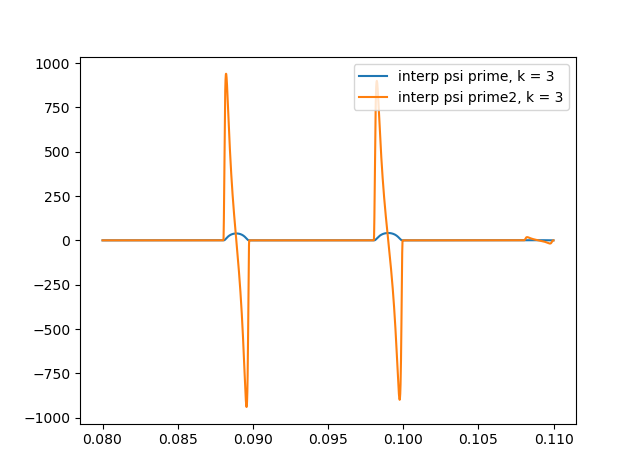

# Kolmogorov-Sprecher-method
Solver for different partial differential equations

## Work in progress

### The Sprecher function and its linear and sigmoid interpoations

### Derives of the Sprecher function sigmoid inerpoliations
 
